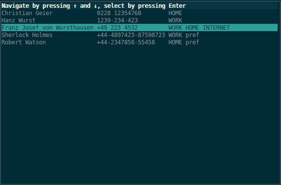

choose - make choices on the command line
=========================================

reads lines from stdin, lets user choose one line in an urwid (ncurses like)
interface, then prints that line to stdout and exits. Input will be aligned to
tabs(`\t`).  After reading from stdin, in attaches itself directly to the
currently active tty, thus it can work with piped input:
 
  get_data.sh | **choose** | other_script.sh

Choose should run on all *NIXes, but might not work in non utf-8 locales.

An example of piping the output of [pc_query](http://github.com/geier/pycarddav) -t *searchstring* into *choose*:

